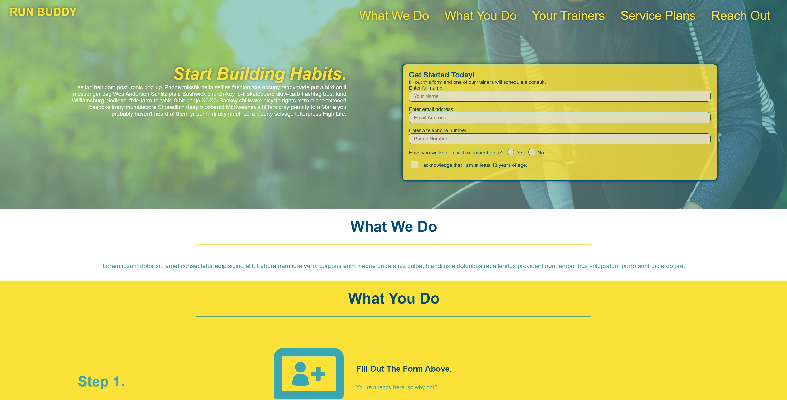

# Run Buddy

## Description:

Run Budy is a landing page developed with lead generation in mind. This front end landing page will be used to call customers to action, filling out a card to receive more infomration about various services. 

## Application Screenshot

# Table of Contents 
- [License](#license)
- [Contributions](#contributions)
- [Technologies Used](#languages)
- [Questions](#questions)

## License:
For more information about licenses, please visit:
[License](https://opensource.org/licenses/MIT)

## Contributions:

Seth Uschuk

## Technologies Used

* HTML
* CSS

## Questions:

If you have any questions, please see GitHub's Guide to a Professional README, my GitHub Page, or feel free to reach out by email:

-[GitHub's Guide to a Professional README](https://github.com/coding-boot-camp/potential-enigma/blob/master/readme-guide.md)

- [My Github Profile](https://github.com/suschuk24)

- [My Email](suschuk24@gmail.com)

  
